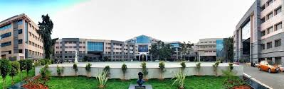

# Resume1

-MSRIT Collage

-1MS1962RIT001

## Contact Information
- **Email:** johndoe@example.com
- **LinkedIn:** [linkedin.com/in/johndoe](https://linkedin.com/in/johndoe)
- **GitHub:** [github.com/johndoe](https://github.com/johndoe)
- **Phone:** (123) 456-7890

## Objective
M. S. Ramaiah Institute of Technology (MSRIT), now known as Ramaiah Institute of Technology, is one of the top engineering colleges in Bangalore, Karnataka, India. Established in 1962 by the renowned industrialist and philanthropist Dr. M. S. Ramaiah, the institution has become well-regarded for its engineering, management, and research programs.
